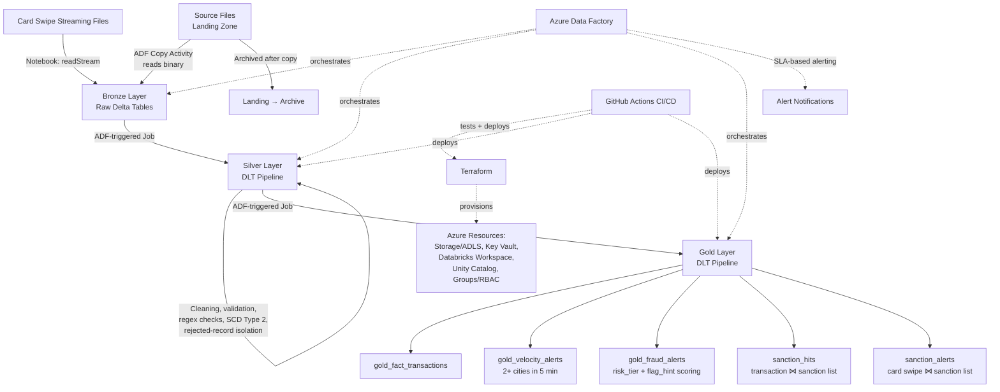
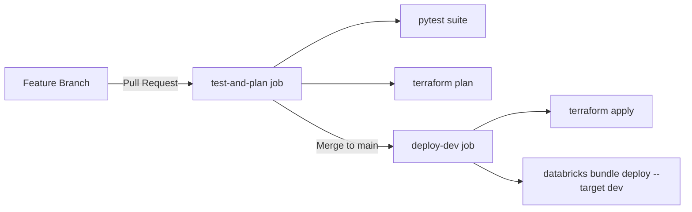

# Al-Waha Bank — Real-Time Fraud Detection Platform

A production-style, end-to-end data engineering platform that ingests banking data, transforms it through a Medallion architecture, and detects fraud and sanctions-list violations in near real time — fully automated with Infrastructure as Code and CI/CD.

---

## Overview

This project simulates a real banking data platform for **Al-Waha Bank**, built to detect two categories of financial risk:

- **Fraud alerts** — suspicious card activity, scored using a customer risk-tier model combined with behavioral flags
- **Velocity alerts** — a customer swiping their card in 2+ different cities within a 5-minute window
- **Sanction hits / sanction alerts** — customers or card swipes matched against a sanctions watchlist

The platform is built on **Azure Databricks (Lakeflow Declarative Pipelines / DLT)**, orchestrated by **Azure Data Factory**, and provisioned end-to-end with **Terraform**. Every change is validated and deployed automatically through a **GitHub Actions CI/CD pipeline**.

---

## Architecture



**Data flow, end to end:**

1. Source files land in a **landing zone**.
2. **ADF Copy Activity** reads the files (binary), lands them in **Bronze**, then archives the originals out of the landing zone.
3. Card swipe data arrives as a **streaming** source and is picked up by a dedicated notebook (`readStream`) straight into Bronze as a Delta table.
4. An **ADF-triggered Databricks job** runs the **Silver DLT pipeline** — reading Bronze, cleaning, validating, and writing clean/rejected outputs.
5. Another **ADF-triggered job** runs the **Gold DLT pipeline** — building fact tables and fraud/velocity/sanctions detection logic.
6. **ADF owns orchestration and SLA-based alerting** for the whole pipeline; **Databricks owns all the data transformation logic**.

---

## Fraud & Risk Detection Logic

| Detection | Layer | Logic |
|---|---|---|
| **Velocity Alerts** | Gold | Groups card swipes by customer in 5-minute tumbling windows; flags any window where the customer swiped in **2 or more distinct cities** |
| **Fraud Alerts** | Gold | Joins swipes to customer risk tier → `risk_score` (HIGH = 0.6, MEDIUM = 0.3, LOW = 0.1) + `hint_score` (behavioral flag = 0.4) → flags when `fraud_score >= 0.5` |
| **Sanction Hits** | Gold | Joins the **transactions** table against the sanctions watchlist on `customer_id` |
| **Sanction Alerts** | Gold | Joins the **card swipes** table against the sanctions watchlist on `customer_id` (kept separate from sanction hits since transaction and swipe data change independently) |

Each Silver-layer table applies **row-level validation** (ID format checks via regex, referential checks against dimension tables, required-field checks, future-date checks) and separates records into **clean** vs **rejected** outputs, with DLT expectations used for **live data-quality monitoring**.

---

## Medallion Architecture

| Layer | Purpose | Technology |
|---|---|---|
| **Bronze** | Raw ingestion from landing zone into Delta tables, no transformation | Databricks Notebooks (batch + streaming), triggered by ADF |
| **Silver** | Cleaning, standardization, validation, deduplication, SCD Type 2 history for dimensions | Databricks Lakeflow Declarative Pipelines (DLT) |
| **Gold** | Business-ready fact tables, fraud/velocity/sanctions detection | Databricks Lakeflow Declarative Pipelines (DLT) |

**Domains covered:** Customers, Accounts, Transactions, Sanction List, Card Swipes.

**Unity Catalog structure:**
- Catalog: `alwaha_banking_dev_001`
- Schemas: `bronze`, `silver`, `gold`, plus dedicated **monitoring** and **governance** schemas

---

## Tech Stack

**Data & Compute**
- Azure Databricks (Lakeflow Declarative Pipelines / DLT)
- PySpark / Delta Lake
- Unity Catalog (catalogs, schemas, grants, RBAC groups)

**Orchestration**
- Azure Data Factory (ingestion, job triggering, SLA-based alerting)

**Infrastructure as Code**
- Terraform (Azure Resource Group, ADLS Storage Account, Key Vault, Databricks Workspace, Unity Catalog objects, Databricks groups)
- Remote state backend (Azure Storage Account)

**CI/CD**
- GitHub Actions
  - Pull request → automated `pytest` suite + `terraform plan`
  - Merge to `main` → `terraform apply` + `databricks bundle deploy`
- Databricks Asset Bundles (DAB) for automated pipeline/notebook deployment
- Azure Service Principal–based authentication (no interactive login in CI)

**Testing**
- `pytest` + local PySpark session for unit-testing every Silver/Gold transformation function in isolation, covering every validation rejection reason individually

---

## Project Structure

```
Al-Waha-Bank-Real-Time-Fraud/
├── .github/workflows/           # CI/CD pipeline (GitHub Actions — deploy-dev.yaml)
├── alwaha-ias-terraform/        # Terraform IaC (Azure + Databricks resources)
├── databricks/                  # All Databricks source code
│   ├── bronze/                  # Ingestion notebooks (batch + streaming)
│   ├── pl_silver_transformation/    # Silver DLT pipeline
│   ├── pl_gold_transformation/      # Gold DLT pipeline (fraud, velocity, sanctions)
│   ├── transformations/         # Pure, unit-testable transformation logic
│   └── utilities/               # Shared cleaning helpers & DLT expectations
├── dab/                         # Databricks Asset Bundle config (databricks.yml + resources)
├── adf/                         # Azure Data Factory source (Git-integrated ADF project)
│   ├── dataset/                 # ADF dataset definitions
│   ├── linkedService/           # ADF linked services (Databricks, ADLS, Key Vault)
│   ├── pipeline/                 # ADF orchestration pipelines
│   ├── factory/                  # ADF factory-level settings
│   └── infra/                    # SLA-based alert configuration
├── tests/                       # Pytest suite (one file per domain/table)
└── requirements.txt
```

Business logic is deliberately kept out of the DLT pipeline files and factored into standalone `transformations/` functions — this is what makes every rule (each validation, each fraud score branch, each rejection reason) independently unit-testable with `pytest`, without needing a live Databricks cluster.

Two orchestration/provisioning systems are used side by side, intentionally: **Terraform** owns core infrastructure (storage, compute, security, and select ADF resources such as the Databricks linked service), while the bulk of the **ADF pipelines, datasets, and SLA alerts** are authored through the ADF UI and version-controlled via ADF's own Git integration (`adf/` folder, published via the `adf_publish` branch).

---

## CI/CD Pipeline



- Every pull request automatically runs the **full pytest suite** and a **Terraform plan** before anything can be merged.
- Every merge to `main` automatically **provisions/updates Azure infrastructure** and **deploys the Databricks bundle** to the `dev` target — no manual deployment steps.
- Authentication uses an **Azure Service Principal** end to end (Terraform, Databricks provider, and Azure backend all use non-interactive credentials suitable for automation).

---

## Key Engineering Decisions

- **Separation of transformation logic from orchestration** — every DLT pipeline file is a thin wrapper; the actual logic lives in plain, testable Python functions.
- **Rejected-record isolation** — every Silver transformation splits output into clean and rejected paths with explicit rejection reasons, instead of silently dropping bad data.
- **Dual Databricks provider authentication** — a workspace-scoped provider (PAT) for pipeline/job resources, and a separate account-scoped provider (Azure Service Principal) for account-level resources, explicitly split via `auth_type` to avoid authentication conflicts.
- **Remote Terraform state** — state is stored in Azure Blob Storage (not locally), so CI/CD and local development always operate against the same infrastructure state.

---

## Status

Currently deployed and fully automated against a **development environment** (`alwaha_banking_dev_001`). The same Terraform/CI-CD design supports promoting to staging/production environments by adding additional environment targets.

---

## Author

Built and engineered end-to-end by **Mehran Ali**.
